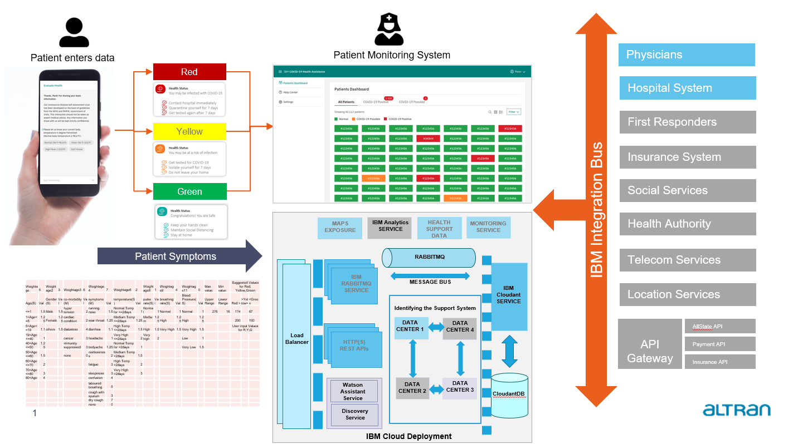
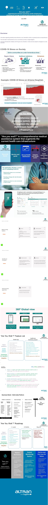
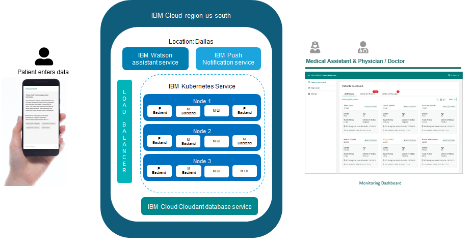

# Title

#### are you well ?

## Contents

1. [Value Offered](#value-offered)
1. [Demo video](#demo-video)
1. [The architecture](#the-architecture)
1. [Long description](#long-description)
1. [Project roadmap](#project-roadmap)
1. [UX Design](#ux-design)
1. [Getting started](#getting-started)
1. [Deployment model](#deployment-model)
1. [Configuration Parameters](#configuration-parameters)
1. [Live demo](#live-demo)
1. [Built with](#built-with)
1. [Versioning](#versioning)
1. [Authors](#authors)
1. [Acknowledgments](#acknowledgments)

### Value offered

Comprehensive medical assistance system augmenting the stressed mainstream health infrastructure

### How can technology help?

Technology used like IBM Watson, Kubernetus, cloudant database helps rapid development and reuse of reference proven architecture. 

### The idea

Reduce stress on public healthcare services by providing effective care in home isolation for patients in crisis pandenmic situation

## Demo video

- [Demo Video - PATH](https://youtu.be/m2pl_GDp1yo)

- [Additional Demo Video - PATH](offering-docs/are%20you%20well_APP_v4.wmv)

## The architecture



## Long description

The “Are You Well?” application is built on a scalable, extensible, resilient multi-sided platform.  We leverage IBM Watson Assist, IBM Discovery Service, IBM Cloudant DB and other IBM infrastructure services.

The application will aid in combatting COVID-19 by reducing the stress on the over-taxed medical system, accounting for the overall wellness of an individual, providing access to vital information and services, and, eventually, helping us to re-open society.
 
The application is persona-based and addresses the need of a patient, patient assistant, a healthcare provider, and a physician.  Any patient can sign up from their mobile phone and use the available resources. On the application, the patient, aided by Watson Assist, can provide vital symptom information and relevant data and be advised about their infection risk level based on his or her symptoms.  The system evaluates the infection risk and classifies as high, medium, or low, based on symptoms and parameters entered by the patient and the parameter weightage matrix defined by the doctor/health authority. The patient is then advised on the next steps, including an option to connect with a medical professional. This initial, informative interaction occurs outside of a hospital or medical setting to avoid the risk of exposure or transmission and provides peace of mind to the patient.  The patient receives trusted and valuable insight in the safety of their home.

A healthcare provider or physician can assess, monitor, respond to, and advise their patients from an intuitive dashboard. They can examine the details of patient-reported symptoms, prepare physician notes, connect with the patient, and provide a referral to an available medical facility if needed. This allows medical professionals to operate more efficiently and to focus on patient care with more informed insight while also keeping the patient in a safe environment.  With Views, sorts, and reporting spans macro to micro and communication functionality built-in, the result is treatment and patient vectoring that are more informed, more effective and more timely.
 
Beyond the current focus on COVID-19, this application has the potential to be extended to a variety of medical services.  In addition, capabilities like opt-in patient tracking, virus tracing, geo-fencing which can further enhanced the visibility of the disease and improve care of any given population could provide benefits to the worldwide population along with the adaptability for other applications like drug trial wellness monitoring.   The citizen wellness is a primary mission of government, this application can be extended to provide government more comprehensive insight into their commonwealth condition to aid their decision making. 
 
With our core competency and heritage in building user-centered designed enterprise-grade, scalable systems, we have designed and begun to implement a wellness platform that address the immediate challenges and risks posed to every individual by COVID-19.   As the world work to gain control over COVID-19, we will expand this system with a continued focus on resilience, scalability, and extensibility to connect individuals to medical care.  
 
We have completed and will present the overall platform design, flow, and an initial set of application screenshots.

## Project roadmap

##### Detailed Roadmap is available at [PATH](offering-docs/Call%20for%20Code%20Are%20You%20Well%20Platform%20Deck%20Jul%20v1.0.pdf)
Call for Code Are You Well Platform Deck Jul v1.0.pdf



## UX Design

| Details                    | URL |
| ------                     | ------ |
| <strong>Introduction</strong> - Designing a seamless experience for the patient and medical practitioners using persona, user journey.                | [Intro.pdf](https://github.com/hackaltran/Altran-CFC-Covid-19/blob/master/UX_Design/Intro.pdf) |
| <strong>User Persona</strong> - We created a user person to identify the users. There are four types of users.                | [Users.pdf](https://github.com/hackaltran/Altran-CFC-Covid-19/blob/master/UX_Design/Users.pdf) |
| <strong>Hills</strong> - Hills are statements of intent written as meaningful user outcomes. They tell you where to go, not how to get there, empowering teams to explore breakthrough ideas without losing sight of the goal.                      | [Hills.pdf](https://github.com/hackaltran/Altran-CFC-Covid-19/blob/master/UX_Design/Hills.pdf) |
| <strong>User Flow</strong> - We created user flows to identify the journey of the user.                   | [UserFlows.pdf](https://github.com/hackaltran/Altran-CFC-Covid-19/blob/master/UX_Design/UserFlows.pdf) |
| <strong>Visual Design</strong> - This is a visual design flow of all four users. We are showing all user's journey here.             | [VisualScreenFlows.pdf](https://github.com/hackaltran/Altran-CFC-Covid-19/blob/master/UX_Design/VisualScreenFlows.pdf) |
| <strong>Prototype</strong> - This is a clickable prototype for Mobile App/ Website which gives an idea of how a user will interact with the App/website.                  | [Mobile App Screen](https://xd.adobe.com/view/badd3b96-443f-442c-4b17-1f791ae99b8e-ccec/)
|                            |[Medical Assistant Screen](https://xd.adobe.com/view/ea338b94-c972-494b-75f7-29a5e62a8cb2-9c02/ )
|                            |[Doctor's Screen](https://xd.adobe.com/view/23568715-1447-49cf-7068-e440efe897ad-5567/)|


## Getting started

To get started with Health Assistant solution, you can choose any of the following two approaches - 

#### Approach 1 : Build and compile the solution
Take git clone at a location of your choice on your system.

```
   git clone https://github.com/hackaltran/Altran-CFC-Covid-19.git
```
After clone verify the following folders :

- CFC_API : Patient Backend Service
- CFC_UI : Patient App
- CFC_Monitoring : Monitoring Backend Service
- CFC_MonitoringUI : Moniroting Dashboard

Use the README.md files to build and compile solutions as mentioned below -

| Solution                   | README |
| ------                     | ------ |
| Patient Backend Service    | [README.md](https://github.com/hackaltran/Altran-CFC-Covid-19/blob/master/CFC_API/README.md) |
| Patient App                | [README.md](https://github.com/hackaltran/Altran-CFC-Covid-19/blob/master/CFC_UI/README.md) |
| Monitoring Backend Service | [README.md](https://github.com/hackaltran/Altran-CFC-Covid-19/blob/master/CFC_Monitoring/README.md) |
| Moniroting Dashboard       | [README.md](https://github.com/hackaltran/Altran-CFC-Covid-19/blob/master/CFC_MonitoringUI/README.md) |

#### Approach 2 : Use the existing deployed infrastructure 

Use the following URL's to access the existing infrastructure -

| Infrastructure             | Deployment |
| ------                     | ------ |
| Patient App                | [Mobile App - Patient](https://github.com/hackaltran/Altran-CFC-Covid-19/tree/master/CFC_UI/apk) |
| Moniroting Dashboard       | [Monitoring Dashboard](http://52.117.130.142:32639/login) |
| Patient Backend Service    | [Patient Restful APIs are available at IP: 52.117.130.141, Port: 30551] |
| Monitoring Backend Service | [Monitoring Restful APIs are available at IP: 52.117.130.139, Port: 31562] |

#### Default Credentials
To use solution and existing deployed infrastructure, you can register yourself as a new patient or you can use the default credentials saved in our cloudant database placed at respective paths-

###### Patient (to be used for accessing Patient Mobile App) - [PATH](https://github.com/hackaltran/Altran-CFC-Covid-19/blob/master/CFC_UI/apk/patient_app_credentials.txt)

###### Doctor (to be used for accessing Monitoring Dashboard) - [PATH](https://github.com/hackaltran/Altran-CFC-Covid-19/blob/master/CFC_MonitoringUI/public/monitor_dasboard_credentials.txt)

###### Medical Assistant (to be used for accessing Monitoring Dashboard) - [PATH](https://github.com/hackaltran/Altran-CFC-Covid-19/blob/master/CFC_MonitoringUI/public/monitor_dasboard_credentials.txt)

## Deployment Model




## Configuration Parameters


## Built with

* [Express](https://expressjs.com/) - Fast, unopinionated, minimalist web framework for Node.js
* [React](https://reactjs.org/) - A JavaScript library for building user interfaces
* [React Native](https://reactnative.dev/) - A framework for building native apps using React
* [IBM Cloudant](https://www.ibm.com/in-en/cloud/cloudant) - Cloudant is a non-relational, distributed database cloud-based service based on the Apache-backed CouchDB project and the open source BigCouch project.
* [IBM Watson](https://www.ibm.com/in-en/watson) - Watson is a question-answering computer system capable of answering questions posed in natural language, developed in IBM's DeepQA project.
* [IBM Push Notification](https://www.ibm.com/in-en/cloud/push-notifications) - Push Notifications service provides a unified push capability to send personalized and segmented real-time notifications to mobile and web applications.
* [docker](https://www.docker.com/) - Docker is a set of platform as a service products that uses OS-level virtualization to deliver software in packages called containers.
* [kubernetes](https://kubernetes.io/) - Kubernetes (K8s) is an open-source system for automating deployment, scaling, and management of containerized applications.


## Versioning

Call for Code github for April 2020 submission is available under git tag v1.0.0.0
Call for Code github for July 2020 submission is available under git tag v2.0.0.0


## Authors

- Deepak Goyal
- Hitesh Choudhary
- Manoj Gupta
- Chandresh Tiwari
- Yogesh Kumar

## License

Proprietary. The code is submitted on a “as is” basis for the sole purpose of “Call for code 2020 COVID-19” challenge participation

## Acknowledgments

* [Express](https://expressjs.com/) - Fast, unopinionated, minimalist web framework for Node.js
* [React](https://reactjs.org/) - A JavaScript library for building user interfaces
* [React Native](https://reactnative.dev/) - A framework for building native apps using React
* [IBM Cloudant](https://www.ibm.com/in-en/cloud/cloudant) - Cloudant is a non-relational, distributed database cloud-based service based on the Apache-backed CouchDB project and the open source BigCouch project.
* [IBM Watson](https://www.ibm.com/in-en/watson) - Watson is a question-answering computer system capable of answering questions posed in natural language, developed in IBM's DeepQA project.
* [IBM Push Notification](https://www.ibm.com/in-en/cloud/push-notifications) - Push Notifications service provides a unified push capability to send personalized and segmented real-time notifications to mobile and web applications.
* [docker](https://www.docker.com/) - Docker is a set of platform as a service products that uses OS-level virtualization to deliver software in packages called containers.
* [kubernetes](https://kubernetes.io/) - Kubernetes (K8s) is an open-source system for automating deployment, scaling, and management of containerized applications.
 * [Carbon Design System - IBM](https://www.carbondesignsystem.com/) - Design Language used for whole project
